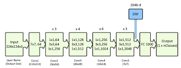
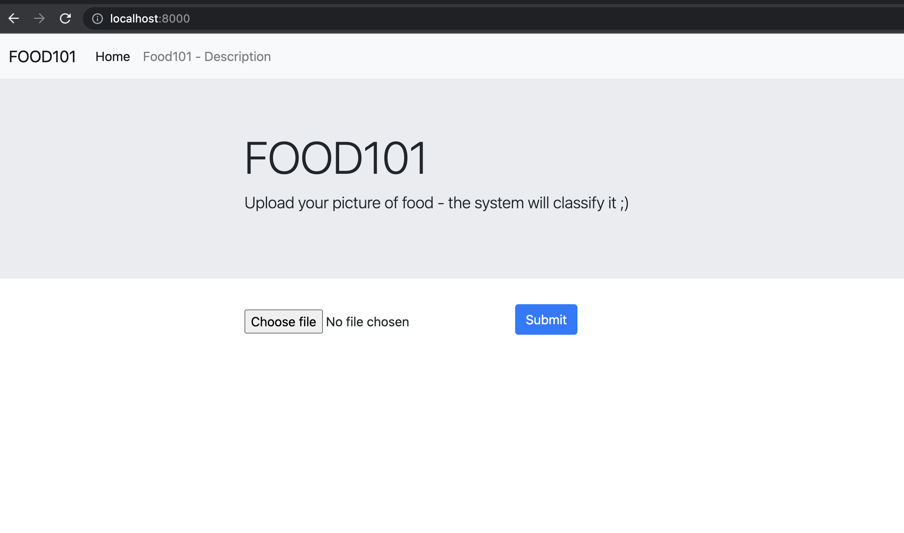
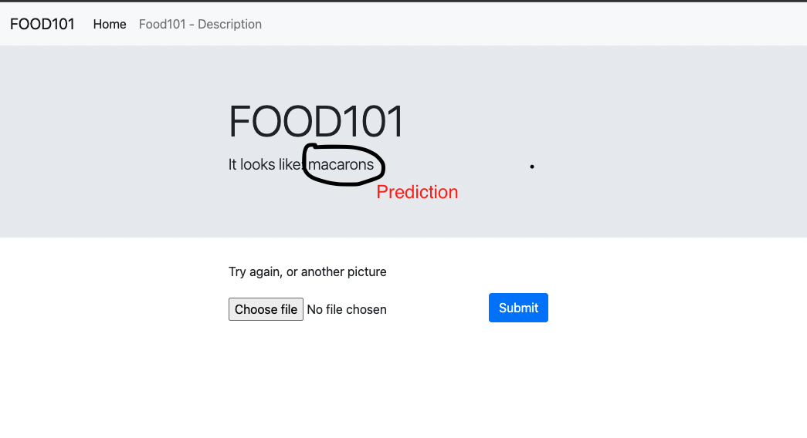
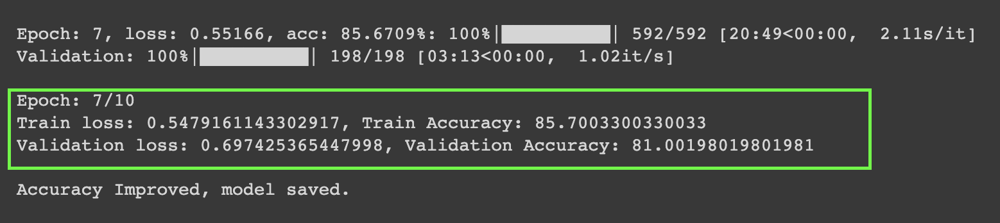
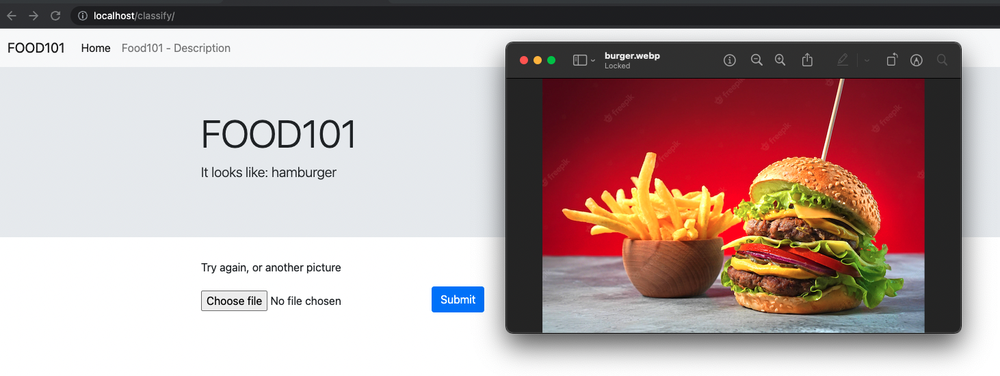

# final_project_lsml2
HSE LSML2 final project

Idea: web app - where user can upload the picture and model will identify what food is it.

High-level architecture:
1. fastAPI - as backend for the webapplication;
2. pytorch model (resnet50) to make predictions;

# The dataset 
(https://www.kaggle.com/datasets/kmader/food41?resource=download):

The dataset contains a number of different subsets of the full food-101 data. The idea is to make a more exciting simple training set for image analysis than CIFAR10 or MNIST. For this reason the data includes massively downscaled versions of the images to enable quick tests. The data has been reformatted as HDF5 and specifically Keras HDF5Matrix which allows them to be easily read in. The file names indicate the contents of the file. For example:
 - foodc101n1000_r384x384x3.h5 means there are 101 categories represented, with n=1000 images, that have a resolution of 384x384x3 (RGB, uint8)
 - foodtestc101n1000r32x32x1.h5 means the data is part of the validation set, has 101 categories represented, with n=1000 images, that have a resolution of 32x32x1 (float32 from -1 to 1)

(The data was repackaged from the original source (gzip) available at https://www.vision.ee.ethz.ch/datasets_extra/food-101/)

# The model architecture:

It was decided to use pretrained RESNET50 available in pytorch package. Last fully connected layer has been changed accordingly, as 101 classes are represented in the dataset. The architecture of the net as follows:

Transfer learning technique was used to train the model on 101 classes of the different food. 
Training was done:
 - 10 epochs;
 - Adam optimizer;
 - learning rate: 4e-5;

Training was done in Colab, to reproduce the training, jupyter notebook is attached (lsml2_final_project_maksim_lebedev.ipynb)

After the model training, pytorch model was saved. It is not a big model in the end (around 90 MB) - so it could stay this way.

# Instructions:

Dockerfile:
 - git clone https://github.com/miskamvedebel/final_project_lsml2.git
 - docker build . -t food101_image
 - docker run -p 80:80 --name food101 food101_image
 - open localhost:80

 As result you will see the following interface:
 

 Once the photo is uploaded and prediction is done - the following screen will be shown:
 

# Accuracy achieved:

Best accuracy achieved on validation set is 81%, with training accuracy of 85%. It is achieved on 7th epoch.

# Results:
There are some pictures to try attached.
One of the examples look like this:

# Future steps:
- add calories prediction;
- add option to save the image;
- add option to store the correct answer;
- add DB;

# Materials used:

- https://www.kaggle.com/datasets/kmader/food41?resource=download;
- https://www.kaggle.com/code/mrmaheshchavan/foodclassification-resnet-vs-efficientnet-10epochs;
- https://www.kaggle.com/code/pranshu15/pytorch-resnet50-84/notebook;
- https://www.kaggle.com/code/pranshu15/pytorch-efficientnetb5-acc84/notebook;